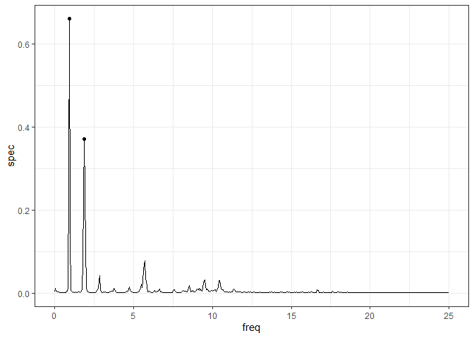

# Actigraphy Metrics
Cory Holdom

## Overview

Pipeline for the derivation of activity summary metrics for wrist-worn
wearables outcomes.

Examples are sourced from the [MotionSense
dataset](https://www.kaggle.com/datasets/malekzadeh/motionsense-dataset).

``` r
library(tidyverse)
```

    ── Attaching core tidyverse packages ──────────────────────── tidyverse 2.0.0 ──
    ✔ dplyr     1.1.4     ✔ readr     2.1.5
    ✔ forcats   1.0.0     ✔ stringr   1.5.1
    ✔ ggplot2   3.5.2     ✔ tibble    3.2.1
    ✔ lubridate 1.9.4     ✔ tidyr     1.3.1
    ✔ purrr     1.0.4     
    ── Conflicts ────────────────────────────────────────── tidyverse_conflicts() ──
    ✖ dplyr::filter() masks stats::filter()
    ✖ dplyr::lag()    masks stats::lag()
    ℹ Use the conflicted package (<http://conflicted.r-lib.org/>) to force all conflicts to become errors

``` r
library(gsignal)
```


    Attaching package: 'gsignal'

    The following object is masked from 'package:lubridate':

        dst

    The following object is masked from 'package:dplyr':

        filter

    The following objects are masked from 'package:stats':

        filter, gaussian, poly

``` r
filter = dplyr::filter
```

``` r
Data_raw_walk <- readr::read_csv(
  "../Motionsense Data/A_DeviceMotion_data/wlk_7/sub_1.csv",
  col_types = cols_only(`...1` = col_number(),
                        userAcceleration.x = col_double(),
                        userAcceleration.y = col_double(),
                        userAcceleration.z = col_double())
)

names(Data_raw_walk) <- c("ts",
                          "userAcceleration_X",
                          "userAcceleration_Y",
                          "userAcceleration_Z")

Data_raw_walk$ts = Data_raw_walk$ts / 50 # Converting index to a relative time in seconds

Data_raw_walk[,5] = sqrt(Data_raw_walk[,2] ** 2 +
                                           Data_raw_walk[,3] ** 2 +
                                           Data_raw_walk[,4] ** 2)

names(Data_raw_walk)[5] = "userAcceleration_VM"

head(Data_raw_walk)
```

    # A tibble: 6 × 5
         ts userAcceleration_X userAcceleration_Y userAcceleration_Z
      <dbl>              <dbl>              <dbl>              <dbl>
    1  0               0.0917             0.416               0.0937
    2  0.02            0.367              0.00457            -0.106 
    3  0.04            0.172             -0.217              -0.163 
    4  0.06            0.00496           -0.238              -0.0191
    5  0.08           -0.0403            -0.241               0.0152
    6  0.1            -0.0908            -0.286              -0.0346
    # ℹ 1 more variable: userAcceleration_VM <dbl>

``` r
ggplot(Data_raw_walk[1000:1500,], aes(x = ts, y = userAcceleration_VM)) +
  theme_bw() +
  geom_line() +
  labs(title = "Example 10s of walking data", x = "Duration (s)", y = "Vector magnitude of Acceleration (g)")
```


``` r
clean_acc = function(raw_signal, filter_order = 6, fs = 50, freq_cutoff = c(0.1, 20)){
  
  # Estimate vector magnitude and direction 
  # Filter data with a band-pass Butterworth filter to smooth motion
  # and remove gravity component
  
  w_cutoff = freq_cutoff / (fs / 2)
  
  butt_filt = gsignal::butter(filter_order, w = freq_cutoff / (fs / 2), type = "pass")
  
  clean_signal = gsignal::filtfilt(butt_filt, raw_signal)
  
  print(gsignal::freqz(butt_filt, fs = fs))
  
  return(clean_signal)
  
}

combine_acc = function(raw_signal, clean = TRUE){
  
  if(clean){
    raw_signal = sapply(raw_signal, clean_acc)
  }
  
  vm = (raw_signal[,1] ** 2 + raw_signal[,2] ** 2 + raw_signal[,3] ** 2)**0.5
  
  return(vm)
  
}
```

``` r
Data_clean_walk = data.frame(
  ts = Data_raw_walk$ts,
  sapply(Data_raw_walk[,2:4], clean_acc)
)
```


``` r
Data_clean_walk$userAcceleration_VM = combine_acc(Data_clean_walk[,2:4], clean = F)

ggplot(Data_clean_walk[1000:1500,], aes(x = ts, y = userAcceleration_VM)) +
  theme_bw() +
  geom_line() +
  geom_line(data = Data_raw_walk[1000:1500,], colour = "#662200", alpha = 0.4) +
  labs(title = "Example 10s of (cleaned) walking data", x = "Duration (s)", y = "Acceleration magnitude (g)")
```


``` r
Data_hist = bind_cols(select(Data_raw_walk, userAcceleration_VM), select(Data_clean_walk, userAcceleration_VM))
```

    New names:
    • `userAcceleration_VM` -> `userAcceleration_VM...1`
    • `userAcceleration_VM` -> `userAcceleration_VM...2`

``` r
names(Data_hist) <- c("Raw", "Cleaned")


Data_hist = pivot_longer(Data_hist, cols = c(Raw, Cleaned))

# Distribution of accelerometer readings
ggplot() +
  theme_bw() +
  geom_histogram(data = Data_hist, aes(x = value, fill = name), position = "identity", alpha = 0.4)
```

    `stat_bin()` using `bins = 30`. Pick better value with `binwidth`.


``` r
ggplot() +
  theme_bw() +
  geom_density(data = Data_hist, aes(x = value, y = after_stat(density), fill = name), position = "identity", alpha = 0.4)
```


``` r
psd = gsignal::pwelch(x = Data_clean_walk$userAcceleration_VM, fs = 50, window = 1000, detrend = "short-mean")

plot_data = data.frame(
  freq = psd$freq,
  spec = psd$spec
)

peaks = gsignal::findpeaks(data = psd$spec, MinPeakHeight = 0.1)

peak_data = data.frame(
  freq = psd$freq[peaks$loc],
  spec = psd$spec[peaks$loc]
)


ggplot() +
  theme_bw() +
  geom_line(data = plot_data, aes(x = freq, y = spec)) +
  geom_point(data = peak_data, aes(x = freq, y = spec))
```


